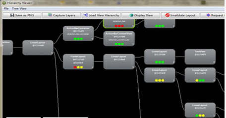

## Android应用的各项优化总结

### 一、内存优化

#### 1、内存分析

使用MAT(Memory Analyzer Tool)工具来分析内存的使用情况。

（1）在DDMS   Heap中导出.hprof文件。

（2）使用**hprof-conv**工具来进行转化.hprof文件。

（3）MAT打开.hprof文件，分析对象的内存使用情况。

#### 2、编程方面

（1）减小Bitmap对象的内存占用。

       尽量复用Bitmap对象，在使用完之后，可以借助recycle()方法显示让GC回收Bitmap对象。

（2）使用压缩图片。

       https://tinypng.com/ 图片压缩网站。

（2）尽量避免使用枚举类。

       枚举变量非常方便，但不幸的是它会牺牲执行的速度和并大幅增加文件体积。

（3）关闭资源对象

       对SQLiteOpenHelper，SQLiteDatabase，Cursor，文件，I/O操作等都应该记得显示关闭。

（4）减少不必要的全局变量。

       局部变量的好处是，当某个方法结束后，相应的局部变量也会被回收。

（5）避免内部Getters/Setters。

       虚方法调用的代价比直接字段访问高昂许多。通常根据面向对象语言的实践，在公共接口中使用Getters和Setters是有道理的，但在一个字段经常被访问的类中宜采用直接访问。无JIT时，直接字段访问大约比调用getter访问快3倍。有JIT时(直接访问字段开销等同于局部变量访问)，要快7倍。

（6）ListView的Adapter优化

       ①Item布局，层级越少越好，使用hierarchyview工具查看优化。 

       ②复用convertView，同时 使用ViewHolder复用子view。

       ④item中有图片时，异步加载

       ⑤快速滑动时，不加载图片 

       ⑦实现数据的分页加载

（7）选择适合的对象引用方式。

       JDK 1.2版本开始，把对象的引用分为4种级别，从而使程序能更加灵活地控制对象的生命周期。这4种级别由高到低依次为：强引用、软引用、弱引用和虚引用。

i.    强引用（StrongReference）

       强引用是使用最普遍的引用。如果一个对象具有强引用，那垃圾回收器绝不会回收它。当内存空间不足，Java虚拟机宁愿抛出OutOfMemoryError错误，使程序异常终止，也不会靠随意回收具有强引用的对象来解决内存不足的问题。

ii.    软引用（SoftReference）

       如果一个对象只具有软引用，则内存空间足够，垃圾回收器就不会回收它；如果内存空间不足了，就会回收这些对象的内存。只要垃圾回收器没有回收它，该对象就可以被程序使用。软引用可用来实现内存敏感的高速缓存。

iii.    弱引用（WeakReference）

       在垃圾回收器线程扫描它所管辖的内存区域的过程中，一旦发现了只具有弱引用的对象，不管当前内存空间足够与否，都会回收它的内存。不过，由于垃圾回收器是一个优先级很低的线程，因此不一定会很快发现那些只具有弱引用的对象。

iv.    虚引用（PhantomReference）

       顾名思义，就是形同虚设。与其他几种引用都不同，虚引用并不会决定对象的生命周期。如果一个对象仅持有虚引用，那么它就和没有任何引用一样，在任何时候都可能被垃圾回收器回收。

### 二、性能优化（UI卡顿优化）

#### 1、层级观察器(Hierarchy Viewer)分析布

​	Android SDK tools目录下提供一个观察布局的工具，层级观察器(Hierarchy Viewer)。Hierarchy Viewer工具是一个非常好的布局优化工具，同时，你也可以通过它学习他人的布局。

​	上面写有控件名称和id等信息，下方的圆形表示这个节点的渲染速度，从左至右分别为测量大小，布局和绘制。绿色最快，红色最慢。右下角的数字为子节点在父节点中的索引，如果没有子节点则为0。点击可以查看对应控件预览图、该节点的子节点数（为6则有5个子节点）以及具体渲染时间。双击可以打开控件图。右侧是树形结构的预览、控件属性和应用界面的结构预览。点击相应的树形图中的控件可以在右侧看到他在布局中的位置和属性。工具栏有一系列的工具，保存为png或者psd等工具。

#### 2、编程方面

（1）优化布局层次结构。

       越扁平化的视图布局，占用的内存就越少，效率越高。我们需要尽量保证布局足够扁平化，当使用系统提供的View无法实现足够扁平的时候考虑使用自定义View来达到目的。

（2）简单布局使用LinearLayout，复杂布局使用RelativeLayout。

​	LinearLayout的性能比RelativeLayout要好，因为RelativeLayout会让子View调用2次onMeasure，LinearLayout 在没有weight时，只调用一次onMeasure()一次。不过如果有weight属性时，也会调用子View的onMeasure()两次。

       如果布局比较复杂，层次比较深时，建议用RelativeLayout，因为RelativeLayout比LinearLayout灵活，可以减少层次结构。

（3）不在UI线程中做复杂的操作。

​	UI线程尽量只做跟UI相关的工作，耗时的工作（数据库操作，I/O，连接网络或者其他可能阻碍UI线程的操作）放入单独的线程处理，尽量用Handler来处理UI thread和thread之间的交互。

（4）图片异步加载。

### 三、APK包优化

1、使用Lint工具查找没有使用到的资源。删掉图片，String，XML等资源。

2、，谨慎添加libs，移除使用不到的libs。

3、使用proguard混淆代码，它会对不用的代码做优化，并且混淆后也能够减少安装包的大小。

4、压缩图片。