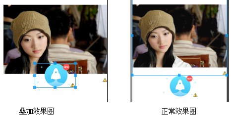
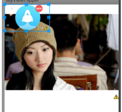
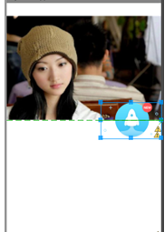

## 实现几个View之间的叠加效果

### 一、使用外边距属性

​	即通过设置属性android:layout_marginTop、android:layout_marginBottom、android:layout_marginLeft 、android:layout_marginRight.的值为负值既可以实现，如：android:layout_marginTo = "-10dp"

【例】在布局中有两张图片，要求将图片2的一部分遮住图片1，如下

```java
<?xml version="1.0" encoding="utf-8"?>
<LinearLayout xmlns:android="http://schemas.android.com/apk/res/android"
    android:layout_width="match_parent"
    android:layout_height="match_parent"
    android:orientation="vertical" >
    <ImageView 
        android:layout_width="wrap_content"
        android:layout_height="wrap_content"
        android:src="@drawable/s3"/>
    <ImageView 
        android:layout_width="wrap_content"
        android:layout_height="wrap_content"
        android:layout_gravity="center_horizontal"
        android:layout_marginTop="-60dp"
        android:src="@drawable/rocket"/>
</LinearLayout>
```

       要求将图片2的一部分遮住图片1，我们只需要将将第二个ImageView的layout_marginTo设置成"-60dp"，图片2就会相对原来的位置向上移60dp，从而实现覆盖效果。

效果图如下：




### 二、使用RelativeLayout以及他的layout_alignParentXXX属性

       RelativeLayout是相当布局，如果在<RelativeLayout>中方多个View，且不设置这些View的相对位置，则所用view都会从屏幕的左上角开始布局绘制，导致这些View叠加在一块。如：

```xml
<LinearLayout xmlns:android="http://schemas.android.com/apk/res/android"
    android:layout_width="match_parent"
    android:layout_height="match_parent"
    android:orientation="vertical" >  
    <RelativeLayout 
        android:layout_width="wrap_content"
    	android:layout_height="wrap_content">
        <ImageView 
        android:layout_width="wrap_content"
        android:layout_height="wrap_content"
        android:src="@drawable/s3"/>
	    <ImageView 
	        android:layout_width="wrap_content"
	        android:layout_height="wrap_content"
	        android:src="@drawable/rocket"/>        
    </RelativeLayout>
</LinearLayout>
```




       因此这些View之间需要通过设layout_alignXXX、layout_toXXX、layout_alignParentXXX等属性来设置相当位置。因此我们可以借助layout_alignParentXXX属性来实现一些特定的叠加效果。

 

       **下面我们看一下如何使用RelativeLayout和它的layout_alignParentXXX属性实现叠加效果。** 

【例】现在我们需要将图片2固定在屏幕的右边中间处，而且是覆盖图片1的形式，即不影响图片1的布局。

```xml
<?xml version="1.0" encoding="utf-8"?>
<LinearLayout xmlns:android="http://schemas.android.com/apk/res/android"
    android:layout_width="match_parent"
    android:layout_height="match_parent"
    android:orientation="vertical" >  
    <RelativeLayout 
        android:layout_width="wrap_content"
    	android:layout_height="match_parent">
        <ImageView 
        android:layout_width="wrap_content"
        android:layout_height="wrap_content"
        android:src="@drawable/s3"/>
	    <ImageView 
	        android:layout_width="wrap_content"
	        android:layout_height="wrap_content"
	        android:layout_alignParentRight="true"
	        android:layout_centerVertical="true"
	        android:src="@drawable/rocket"/>        
    </RelativeLayout>
</LinearLayout>
```



       layout_alignParentXXX顾名思义是相当父布局(不一定是根布局)来布局的，即设置了layout_alignParentXXX属性的view可以显示在父布局中的左、上、右和下位置，不受同一父布局中的其他View影响。

       因此这种方式也有它自己的缺陷，因为它只能设置父布局中的左、上、右和下位置，不够灵活。