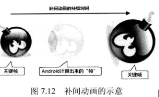
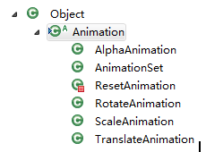
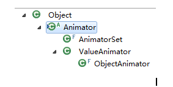

## Animation  动画

         Android的动画主要有三类：逐帧动画（frame）、补间动画（tween）和属性动画。

### 一、逐帧动画

       逐帧动画就是将静态图片按照一定顺序一张张地展示。frame动画的实现方法主要有两种。一种是定义在xmll中；两一种是由纯java编码。

#### 1、定义在xml中。

​	如果被定义在XML文件中，我们可以放置在/res下的anim或drawable目录中，文件名可以作为资源ID在代码中引用。

例子：

（1）定义动画资源文件。

       我们在/res目录下新建一个anim目录，然后在anim目录下新建一个动画资源文件frame.xml如下。

```xml
<?xml version="1.0" encoding="utf-8"?> 
<animation-list xmlns:android="http://schemas.android.com/apk/res/android"
  android:oneshot="false"> 
  <item android:drawable="@drawable/f1" android:duration="300" /> 
  <item android:drawable="@drawable/f2" android:duration="300" /> 
  <item android:drawable="@drawable/f3" android:duration="300" /> 
  <item android:drawable="@drawable/f4" android:duration="300" /> 
</animation-list>
```

       <animation-list>元素是必须的，并且必须要作为根元素，可以包含一或多个<item>元素。

       <item>元素代表一帧动画，android:drawable指定此帧动画所对应的图片资源，android:druation代表此帧持续的时间，整数，单位为毫秒。

       android:onshot如果定义为true的话，此动画只会执行一次，如果为false则一直循环。

（2）定义布局文件。

       我们定义了一个ImageView作为动画的载体，然后定义了两个按钮，分别是停止和启动动画。

```xml
<?xml version="1.0" encoding="utf-8"?> 
<LinearLayout
	 xmlns:android="http://schemas.android.com/apk/res/android"
	 android:orientation="vertical"
	 android:layout_width="fill_parent"
	 android:layout_height="fill_parent"> 
	 <ImageView
 		 android:id="@+id/frame_image"
  		android:layout_width="fill_parent"
  		android:layout_height="fill_parent"
  		android:layout_weight="1"/> 
 	<Button
		  android:layout_width="fill_parent"
 		 android:layout_height="wrap_content"
 		 android:text="stopFrame"
 		 android:onClick="stopFrame"/> 
 	<Button
		android:id="@+id/start_btn"
		  android:layout_width="fill_parent"
		  android:layout_height="wrap_content"
 		 android:text="runFrame"
 		 android:onClick="runFrame"/> 
</LinearLayout>
```

（3）加载动画文件实现动画效果。

```java
public class FrameActivity extends Activity { 
 	 private ImageView image; 
  	@Override
  	protected void onCreate(Bundle savedInstanceState) { 
   		 super.onCreate(savedInstanceState); 
    		setContentView(R.layout.frame); 
  		  image = (ImageView) findViewById(R.id.frame_image); 
  		  image.setBackgroundResource(R.anim.frame); 
  		  AnimationDrawable anim = (AnimationDrawable) image.getBackground(); 
		findViewById(R.id. start_btn).setOnClickListener(new OnClickListener(){
			@Override
			public void onClick(View v){
              anim.start();  
            }		
		});
   		  
		......
	  } 
}
```

#### 2、java代码实现

​	如果由完全由编码实现，我们需要使用到**AnimationDrawable**对象。

       在drawable目录下放四张连续的图片分别命名为f1.png，f2.png，f3.png，f4.png。

```java
public class FrameActivity extends Activity { 
  	private ImageView image; 
  	@Override
  	protected void onCreate(Bundle savedInstanceState) { 
    		super.onCreate(savedInstanceState); 
    		setContentView(R.layout.frame); 
   		 image = (ImageView) findViewById(R.id.frame_image); 
		findViewById(R.id. start_btn).setOnClickListener(new OnClickListener(){
			@Override
			public void onClick(View v){
              runFrame();
            }		
		});
 	 } 
 	 public void stopFrame(View view) { 
    		AnimationDrawable anim = (AnimationDrawable) image.getBackground(); 
   		 if (anim.isRunning()) { //如果正在运行,就停止 
  	    		  anim.stop(); 
    		} 
 	 } 
 	 public void runFrame() { 
		    //完全编码实现的动画效果 
    		AnimationDrawable anim = new AnimationDrawable(); 
   		 for (int i = 1; i <= 4; i++) { 
     			 //根据资源名称和目录获取R.java中对应的资源ID 
   			   int id = getResources().getIdentifier("f" + i, "drawable", 				 													getPackageName()); 
     			 //根据资源ID获取到Drawable对象 
   			   Drawable drawable = getResources().getDrawable(id); 
   			   //将此帧添加到AnimationDrawable中 
    			  anim.addFrame(drawable, 300); 
    		} 
   		 anim.setOneShot(false); //设置为loop 
 		 image.setBackgroundDrawable(anim); //将动画设置为ImageView背景 
   		 anim.start();  //开始动画 
  	} 
}
```

### 二、补间（Tween）动画

       补间动画就是指开发者只需要指定动画的开始、结束“关键帧”，而动画变化的“中间帧”有系统来计算并补齐。



       补间动画定义的开始帧、结束帧只是一些简单的变化，比如图形大小的缩放、移动、旋转角度的改变等。Android使用Animation代表抽象动画类，它有以下几个子类。



**（1）AlphaAnimation：**透明度改变的动画。创建该动画时要指定动画开始的透明度、结束时的透明度和动画持续时间。其中透明度可从0到1变化。

**（2）ScaleAnimation：**大小缩放动画。创建该动画时要指定动画开始的缩放比例（以x、y轴的缩放参数来表示）和结束动画的比，并指定动画持续时间。由于缩放时以不同点为中心时缩放的效果不同，因此还要pivotX、pivotY来指定缩放中心坐标。

**（3）TranslateAnimation：**位移变化动画。需要指定开始位置（X、Y坐标表示）、结束位置，并指定动画持续时间即可。

**（4）RotateAnimation：**旋转动画。需要指定开始、结束时的旋转角度和动画持续时间。另外，还需要通过pivotX、pivotY来指定旋转轴心的坐标。

**（5）AnimationSet：**动画集合类。该类可以同时执行、顺序执行或指定延时之后多种动画效果。【详见：(原)AnimationSet.docx】


#### Interpolator

         为了控制在动画期间需要动态补入多少帧，具体在动画运行的哪些时刻补入帧，需要借助Interpolator。

       Interpolator根据特定算法计算出整个动画所需要动态插入帧的密度和位置，简单地说，Interpolator负责控制动画变化速率，这就使得基本的动画效果（Alpha、Scale、Translate、Rotate）能以匀速、加速、减速、抛物线速度等各种速率变化。

         Interpoloator是一个接口，它定义了所有Interpolator需要的方法，开发者可以通过实现Interpolator来控制动画的变化速度。

       Android为Interpolator提供了如下几个实现类，分别用于实现不同动画变化速度。

LinearInterpolator：动画以匀速改变。

AccelerateInterpolator：动画加速改变。

AccelerateDecelerateInterpolator：动画在开始、结束的地方速度较慢，中间的时候加速。

DecelerateInterpolator：动画减速改变。

       在布局文件中，定义补间动画的<set.../>元素持有一个android:interpolator属性，该属性的值可以指定为Android默认支持的Interpolator。

@android:anim/linear_interpolator

@android:anim/accelerate_interpolator

@android:anim/accelerate_deceleraate_interpolator

......

#### 补间动画例子

       虽然android允许在程序中创建Animation对象，但一般都采用动画资源文件来定义补间动画。

       动画资源文件：

```xml
?xml  version="1.0"  encodeing="UTF-8">
<set  xmlns:android="http://schemas.android.com/apk/res/android/"
	  android:interpolator="@android:anim/linear_interpolator">
	<!-- 缩放变换-->
	<scale  android:fromXScale="1.0"
		android:toXScale="0.01"
		android:fromYScale="1.0"
		android:toYScale="0.01"
		android:pivotX="50%"
		android:pivotY="50%"
		android:fillAfter="true"
		android:duration="3000"/>
	<!-- 透明度变换-->
	<alpha
		android:fromAlpha="1"
		android:toAlpha="0.05"
		android:duration="3000"/>
	
</set>
```

```java
public  class  TweenAnim  extends  Activity{
	@Override
	public  void  onCreate(Bundle  savedInstanceState){
		super.onCreate(savedInstanceState);
		setContentView(R.layout.main);
		final  ImageView  flower = (ImageVIew) findViewById(R.id.flower);
		//加载动画资源
		final  Animation  anim = AnimationUtils.loadAnimation(this , R.anim..anim);
		//设置动画结束后保留结束状态
		anim.setFillAfter(true);
		Button  btn = (Button) findViewById(R.id.btn);
		btn.setOnClickListener(new  OnClickListener(){
			@Override
			public  void  onClick(View  v){
				flower.startAnimation(anim);
			}
		});
	}
}
```

### 三、属性动画

#### 1、属性动画和补间动画的区别

（1）补间动画只能定义两个关键帧在透明度、旋转、倾斜、位移4个方面的变化，但属性动画可以定义任何属性的变化。

（2）补间动画只能对UI组件执行动画，但属性动画几乎可以对任何对象执行动画（不管它是否显示在屏幕上）。

 

#### 2、属性动画与补间动画的相似之处是，属性动画也需要定义以下几个属性。

（1）动画的持续时间。默认300毫秒。在属性动画资源文件里通过android:duration属性指定。

（2）动画差值方式。该属性与补间动画相似。在属性动画资源文件中通android:interpolator指定。

（3）动画重复次数。在资源文件中通过android:repeatCount指定。

（4）重复行为。动画结束后，重复下次动画时，是从开始帧再次播放，还是从结束帧反向播放。资源文件通过andorid:repeatMode指定。

（5）动画集。可以将多个动画合并成一组，既可以让这组动画按次序播放，也可以同时播放。在资源文件中用<set.../>元素组合，android:ordering属性指定动画是按次序播放还是同时播放。

（6）帧刷新频率。指定每隔多长时间播放一帧。

#### 3、属性动画的API



**（1）Animator：** 是属性动画的基类，基本上不会直接使用该类。

**（2） ValueAnimator：** 属性动画主要的时间引擎，它负责计算各个帧的属性值。它定义了属性动画的绝大部分核心功能，包括计算各帧的相关属性值，负责处理更新事件，按属性值的类型控制计算规则。

**（3） ObjectAnimation：** 它是ValueAnimator子类，允许程序员对指定的属性执行动画。如移动、旋转、缩放、透明度变化的动画可直接使用ObjectAnimator，ObjectAnimator已经对这些简单的属性动画进行了封装处理，程序员可以很方便快捷的使用。

**（4） AnimatorSet：** 用于组合多个Animator，并指定多个Animator是按顺序播放合适同时播放。

 

​	除此之外，属性动画还需要利用一个Evaluator（计算器），该工具类控制属性动画如何计算属性值。Android提供了如下的Evaluator。

（1）IntEvaluator：计算int类型属性值的计算器。

（2）FloatEvaluator：....

（3）ArgbEvaluator：计算以16进制形式表示的颜色值的计算器。

（4）TypeEvaluator：它是计算器接口，开发者可以同时实现该接口来实现自定义的计算器。