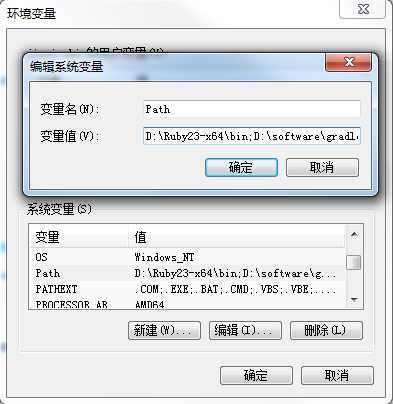
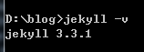
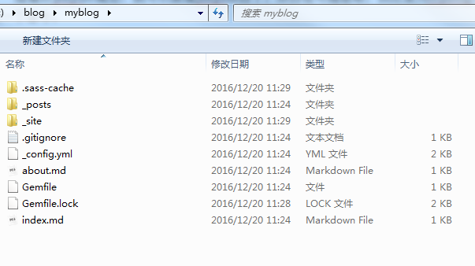
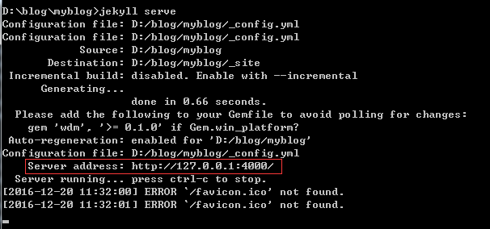
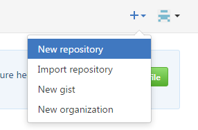
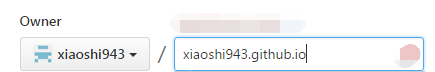
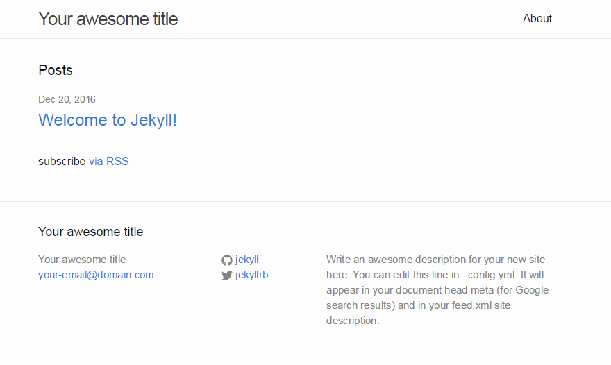
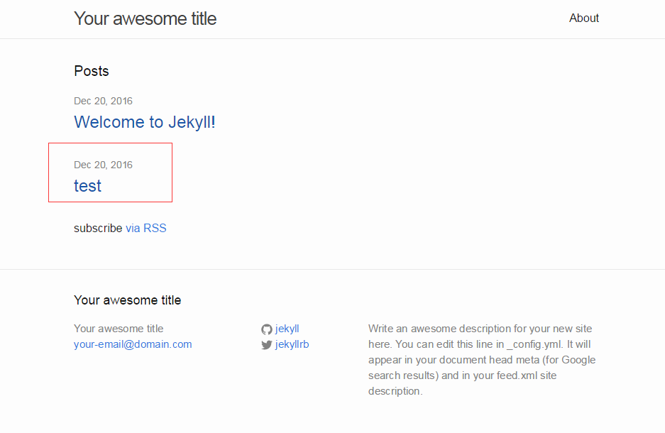

## github+jekyll+markdown搭建个人博客

​         一直想构建一个自己的博客，但苦于找不到满意的平台。听说github写博客也是一个不错的选择，于是就着手试试。在网上搜了了一大堆资料，但都写得比较乱，也不完全。所以根据自己搭建的经历整理出该文章，供大家参考。

​	笔者用的是window系统，所以以下针对window而搭建的博客。

### 一、jekyll

#### 1、安装jekyll

##### (1)首先安装ruby

ruby的下载地址https://rubyinstaller.org/downloads/。下载安装完之后，需要配置一下环境变量path，如下图。




##### (2)安装jekyll

​	安装完ruby之后，就可以安装jekyll了。启动cmd，输入一下命令：

```
gem install jekyll
```


##### (3)安装bundler

接下来需要安装一下bunder，否则新建项目的时候会报错。

```
gem install bundler
```

​	完成上面步骤后，测试一下jekyll是否安装成功，如下图：




#### 2、新建一个jekyll项目

​	搭建好jekyll环境后，就可以新建jekyll项目了，项目名可随意取，我这里为myblog。切换到某个目录下，启动cmd，输入一下命令：

```
jekyll new myblog
```

​	新建的过程有些耗时，需要耐心等待一下。新建好后，我们可以看到项目的目录结构如下：




​	下面我们顺带介绍一下jekyll项目的目录结构以及作用。

```java
|--_config.yml           // 保存配置数据。
|--_drafts            	 //存放未发布的文章。
   |--articles1.textile
   |--articles2.md
|--_includes             //存放页面片段，即页头、脚、导航等
   |--footer.html
   |--header.html
|--_layouts 			//存放模板文件。文章模板、关于页面模板、首页模板等。
   |--default.html
   |--post.html
|--_posts				//存放文章的文件。并且文章文件名称要符合YEAR-MONTH-DAY-title.MARKUP格式。
   |--2014-06-17-articles1.textile
   |--2014-06-17-articles1.md
|--_site				//经过jekyll转换的页面。
|--index.html			//网站首页。
|--other files			//其他文件，存放css、js、image等。
```


#### 3、启动jekyll项目

​	进入你的项目的根目录，输入一下命令

```
jekyll serve
```

​	启动成功后，可以看到控制台输出的地址和端口号。



​	然后在浏览器中输入http://127.0.0.1:4000/ 就能访问到jekyll项目myblog的首页了。


### 二、github

#### (1)首先需要一个git账号，如果没有可以注册一个。

#### (2)创建一个repository

* 登陆到github首页后，直接点击右上角的"+"号，或者选择"new repository"。



* 输入名称的时候需要注意，**格式必须为"username.github.io"**，如下。

  

  ​

* 创建好仓库后，将其克隆到本地的某个目录下。


### 三、github+jekyll

​	经过上面的步骤，我们已经创建好了jekyll项目"myblog"和git仓库"xiaoshi943.github.io"，那么如何将他们结合呢？其实也很简单.

#### (1)要将"myblog"下的所有文件拷贝到"xiaoshi943.github.io"下。

#### (2)然后push到远程仓库即可。

#### (4)在浏览器中输入"username.github.io"就可以访问了。




### 四、github+jekyll+markdown

​	如何将写好的markdown文章放到用github+jekyll搭好的博客平台中呢？这也很简单。

#### (1)用markdown编写的文章必须遵循一定的格式。

​	即在文章的开头必须包含以下内容。其中`layout: post`不能修改，其他的可自行修改。

```java
---
layout: post
title:  "test"
date:   2016-12-20
categories: share
---
```

#### (2)将编写好的markdown文件放到git项目的"_posts"目录下。

#### (3)然后push到远程仓库

#### (4)在浏览器中输入"username.github.io"后，在首页就可以看到新加入的文章了。




