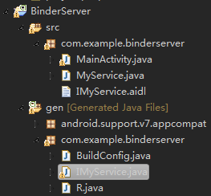
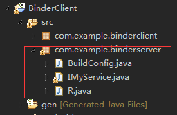

### 1、使用AIDL的步骤

#### 服务端

（1）在Eclipse Android工程的Java包目录中建立一个扩展名为aidl的文件。该文件的语法类似于Java代码，但会稍有不同。保存后，ADT会自动在gen目录下生成一   个对应的Java接口文件（*.java）。

（2）建立一个服务类，继承Service类。

（3）实现由aidl文件生成的Java接口的Stub抽象类，如MyServiceImpl，并让MyService的onBind()方法返回MyServiceImpl的对象。

（4）在AndroidManifest.xml文件中配置AIDL服务，尤其要注意的是，<action>标签中android:name的属性值就是客户端要引用该服务的ID，也就是Intent类的参数值。

#### 客户端

（1）在Activity中创建一个ServiceConnection对象，用于获取远程服务的代理对象（ServiceProxy对象）。

（2）通过bindService()方法启动Service。之后就可以通过服务代理对象与远程服务通信了。


### 2、完整例子

#### 服务端

（1）创建一个android工程，名为BinderServer。

（2）在Java包目录中建立一个IMyService.aidl文件。其内容如下：

```java
package com.example.binderserver;

interface IMyService { 
	String getValue(); 
} 
```

​	保存后，ADT自动在gen目录下生成一个IMyService.java文件。IMyService.java中包含两个内部类：一个是Stub；两一个是Proxy。至于具体内容我们后面介绍。




**另外需要注意的是：**

> * AIDL文件不能加修饰符（例如，public、private）
> * AIDL服务不支持的数据类型（例如，InputStream、OutputStream）


（3）编写一个Service的子类MyService.

（4）并在MyService类中定义了一个内嵌类（MyServiceImpl），该类是IMyService.Stub的子类。 

```java
package com.example.binderserver;

import android.app.Service;
import android.content.Intent;
import android.os.IBinder;
import android.os.RemoteException;

public class MyService extends Service{
	
	public class MyServiceImpl extends IMyService.Stub{

		@Override
		public String getValue() throws RemoteException {
			return "server";
		}
	}

	@Override
	public IBinder onBind(Intent intent) {
		
		return new MyServiceImpl();
	}
}
```

​	**这里需要注意的两点：**

> * IMyService.Stub是根据IMyService.aidl文件自动生成的，一般并不需要管这个类的内容，只需要编写一个继承于IMyService.Stub类的子类，并实现其抽象方法，即接口定义的方法。
> * onBind方法必须返回MyServiceImpl类的对象实例，否则客户端无法获得服务对象。


（5）在AndroidManifest.xml文件中配置MyService类，代码如下：

```xml
<service android:name=".MyService" > 
	<intent-filter> 
        <action android:name="com.server.IMyService" /> 
	</intent-filter> 
</service>
```


#### 客户端

（1）创建一个android工程，名为BinderClient。

（2）将服务端自动生成的IMyService.java文件连同包目录一起复制到BinderClient工程的src目录下。



（3）在Activity中通过ServiceConnection 获取远程服务代理对象，然后通过bindService()绑定服务。

```java
public class MainActivity extends Activity implements OnClickListener{

	private IMyService myService = null; 
	private TextView text;
	private Button bind;

	//获取远程服务代理对象
	private ServiceConnection connection = new ServiceConnection(){
		@Override
		public void onServiceConnected(ComponentName name, IBinder service) {
			myService = IMyService.Stub.asInterface(service);
		}

		@Override
		public void onServiceDisconnected(ComponentName name) {

		}
	};

	@Override
	protected void onCreate(Bundle savedInstanceState) {
		super.onCreate(savedInstanceState);
		setContentView(R.layout.activity_main);
		text = (TextView) findViewById(R.id.text);
		bind = (Button) findViewById(R.id.bind);
		bind.setOnClickListener(this);

		// 绑定AIDL服务      			
		bindService(new Intent("com.server.IMyService"), connection, Context.BIND_AUTO_CREATE); 

	}

	@Override
	public void onClick(View v) {
		
		int id = v.getId();
		switch(id){
		case R.id.bind :
			//调用服务端的getValue方法 
			try {
				text.setText(myService.getValue());
			} catch (RemoteException e) {
				e.printStackTrace();
			}
			break;
		}
	}
}
```

​	**这里需要注意的一点：**

> * 服务端的方法调用（如：myService.getValue()），不能放在OnCreate()、OnResume()等生命周期方法中，因为此时myService对象还是null。


### 3、ADT根据aidl文件自动生成的java类分析

​	我们就拿上述例子来分析，自动生成的IMyService.java内容如下：

```java
package com.example.binderserver;
public interface IMyService extends android.os.IInterface {
	/** Local-side IPC implementation stub class. */
	public static abstract class Stub extends android.os.Binder implements com.example.binderserver.IMyService {
		private static final java.lang.String DESCRIPTOR = "com.example.binderserver.IMyService";
		/** Construct the stub at attach it to the interface. */
		public Stub(){
			this.attachInterface(this, DESCRIPTOR);
		}
		/**
		 * Cast an IBinder object into an com.example.binderserver.IMyService interface,
		 * generating a proxy if needed.
		 */
		public static com.example.binderserver.IMyService asInterface(android.os.IBinder obj){
			if ((obj==null)) {
				return null;
			}
			android.os.IInterface iin = obj.queryLocalInterface(DESCRIPTOR);
			if (((iin!=null)&&(iin instanceof com.example.binderserver.IMyService))) {
				return ((com.example.binderserver.IMyService)iin);
			}
			return new com.example.binderserver.IMyService.Stub.Proxy(obj);
		}
		@Override 
      	public android.os.IBinder asBinder(){
			return this;
		}
		@Override 
      	public boolean onTransact(int code, android.os.Parcel data, android.os.Parcel reply, int flags) throws android.os.RemoteException{
			switch (code){
			case INTERFACE_TRANSACTION:{
				reply.writeString(DESCRIPTOR);
				return true;
			}
			case TRANSACTION_getValue:{
				data.enforceInterface(DESCRIPTOR);
				java.lang.String _result = this.getValue();
				reply.writeNoException();
				reply.writeString(_result);
				return true;
			}
			}
			return super.onTransact(code, data, reply, flags);
		}
		private static class Proxy implements com.example.binderserver.IMyService{
			private android.os.IBinder mRemote;
			Proxy(android.os.IBinder remote){
				mRemote = remote;
			}
          
			@Override 
          	public android.os.IBinder asBinder(){
				return mRemote;
			}
			public java.lang.String getInterfaceDescriptor(){
				return DESCRIPTOR;
			}
          
			@Override 
          	public java.lang.String getValue() throws android.os.RemoteException{
				android.os.Parcel _data = android.os.Parcel.obtain();
				android.os.Parcel _reply = android.os.Parcel.obtain();
				java.lang.String _result;
				try {
					_data.writeInterfaceToken(DESCRIPTOR);
					mRemote.transact(Stub.TRANSACTION_getValue, _data, _reply, 0);
					_reply.readException();
					_result = _reply.readString();
				}
				finally {
					_reply.recycle();
					_data.recycle();
				}
				return _result;
			}
		}
		static final int TRANSACTION_getValue = (android.os.IBinder.FIRST_CALL_TRANSACTION + 0);
	}
	public java.lang.String getValue() throws android.os.RemoteException;
}
```

​	 我们可以看到，IMyService接口中有一个内部的抽象类Stub，是Binder的子类，并实现了IMyService接口。而Stub内部还有一个静态类Proxy，也是实现IMyService接口。接下来我们一个一个地看。

#### Stub

​	该类主要是由服务端使用的。该类之所以是一个抽象类，是因为具体的服务函数必须由程序员来实现。

​	Stub抽象类有两个重要的方法：asInterface()和onTransact()。

（1）asInterface()。该方法是返回服务端的代理对象的。我们在客户对通过ServiceConnection来获取代理对象时就是调用该方法的`IMyService.Stub.asInterface(service)` 。

```java
		public static com.example.binderserver.IMyService asInterface(android.os.IBinder obj){
			if ((obj==null)) {
				return null;
			}
			android.os.IInterface iin = obj.queryLocalInterface(DESCRIPTOR);
          //如果是同一个进程，那么就返回Stub对象本身
			if (((iin!=null)&&(iin instanceof com.example.binderserver.IMyService))) {
				return ((com.example.binderserver.IMyService)iin);
			}
          //如果不是同一个进程，就返回Stub.Proxy这个代理对象了
			return new com.example.binderserver.IMyService.Stub.Proxy(obj);
		}
```


（2）onTransact()。一个Binder服务端实际上是个Binder对象，该对象一旦被创建，内部就会启动一个隐藏的线程。该线程接下来会接收到Binder驱动发送的消息，收到消息后，会执行Binder对象的onTransact()方法，并按照该方法的参数执行不同的服务代码。

```java
		@Override 
      	public boolean onTransact(int code, android.os.Parcel data, android.os.Parcel reply, int flags) throws android.os.RemoteException{
			switch (code){
			case INTERFACE_TRANSACTION:{
				reply.writeString(DESCRIPTOR);
				return true;
			}
			case TRANSACTION_getValue:{
              	//与客户端的writeInterfaceToken对用，标识远程服务的名称
				data.enforceInterface(DESCRIPTOR);
              	//调用服务端（即MyServiceImpl）的getValue方法。
				java.lang.String _result = this.getValue();
				reply.writeNoException();
              	//将getValue()方法返回值写入reply中。
				reply.writeString(_result);
				return true;
			}
			}
			return super.onTransact(code, data, reply, flags);
		}
```

​	我们先看onTransact()方法的四个参数：

* code ：是一个整形的唯一标识，用于区分执行哪个方法，客户端会传递此参数，告诉服务端执行哪个方法。

* data ：客户端传递过来的参数。

* replay ：服务器返回回去的值。

* flags ：标明是否有返回值，0为有（双向），1为没有（单向）。

  至于code是传何值，如何传，这都是AIDL自动完成的，我们先不管这些。

  当客户端请求服务的getValue()，onTransact()就会执行case TRANSACTION_getValue代码块。在这里边执行了服务端的getValue()方法，并将结果写入reply中。


#### Proxy

​	Proxy是一个代理类，运行在客户端。按上面的例子来说，我们用ServiceConnection来获取一个代理对象myService，其实就是Proxy对象。然后调用myService.getValue()方法，实则调用了Proxy的getValue()方法。

```java
			@Override 
          	public java.lang.String getValue() throws android.os.RemoteException{
				android.os.Parcel _data = android.os.Parcel.obtain();
				android.os.Parcel _reply = android.os.Parcel.obtain();
				java.lang.String _result;
				try {
                  //表示远端服务，DESCRIPTOR="com.example.binderserver.IMyService"
					_data.writeInterfaceToken(DESCRIPTOR);
                  //mRemote是一个Binder对象。任意一个服务端Binder对象被创建时，都会在Binder驱动中创建一个							mRemote对象。客户端访问服务是，都是通过mRemote对象访问的。
                  //mRemote执行transact()方法后，会回调Stub的onTransact()方法。Stub.TRANSACTION_getValue就					是客户端给服务器的code
					mRemote.transact(Stub.TRANSACTION_getValue, _data, _reply, 0);
					_reply.readException();
                  //从reply中读取数据
					_result = _reply.readString();
				}
				finally {
					_reply.recycle();
					_data.recycle();
				}
				return _result;
			}
		}
```

​	mRemote的transact()方法主要做一下几件事：

* 以线程间通信模式，向服务端发送客户端传过来的参数。
* 挂起当前线程，即客户端线程，并等待服务器执行完只此昂服务后通知（notify）。
* 接收服务端通知，然后继续执行客户端线程，并返回到客户端代码区。


​	我们发现，Proxy运行在客户端，其getValue()方法是写入请求参数，然后读取服务返回值；而Stub在服务端，其onTransact()是读取客户端传过来的参数，然后写入服务端的返回值，它俩恰好是一对。


