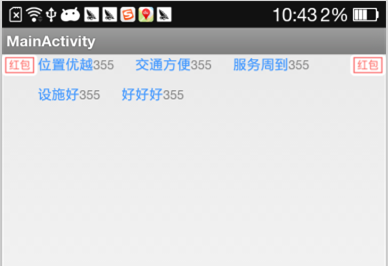

## 自定义流布局

​	所谓的流布局就是从左边的第一行开始排放组件，放不下的就换行。先看一下效果图。




​	Android 的原生组件并没有提供流式布局，因此我们需要自定义一个流布局组件。在这里我们需要继承ViewGroup，然后覆写ViewGroup的onMeasure()和onLayout()方法，另外，我们还要覆写generateLayoutParams()方法，因为我们需要支持layout_margin属性。

* onMeasure()：计算所有childView的宽和高，然后根据childView的宽和高，计算自己的宽和高。
* onLayout()：对所有的childView进行布局。
* generateLayoutParams()：如果要自定义ViewGroup支持子控件的layout_margin参数，则自定义的ViewGroup类必须重载generateLayoutParams()函数，并且在该函数中返回一个ViewGroup.MarginLayoutParams派生类对象，这样才能使用margin参数。


​	另外，我们还要为该组件定义几个额外的属性：

* lineCount ： 最大行数，即可以设置该流布局最多有几行。
* horizontal_spacing ： 横向间距，即两个子组件左右之间的间距。
* vertical_spacing : 纵向间距，即行与行之间的间距。


### 1、定义属性

​	首先，我们为该组件定义一个属性。在values目录下新建一个attrs.xml文件，文件的内容如下：

```xml
<?xml version="1.0" encoding="utf-8"?>
<resources>
    
    <declare-styleable name="Flowlayout">
        <attr name="layout_weight" format="integer"></attr>
        <attr name="vertical_spacing" format="integer"></attr>
        <attr name="horizontal_spacing" format="integer"></attr>
        <attr name="lineCount" format="integer"></attr>
    </declare-styleable>
    
</resources>
```

### 2、自定义组件

```java
/**
 * 该流布局可以使用以下属性：
 * @ lineCount ： 最大行数
 * @ horizontal_spacing ： 横向间距
 * @ vertical_spacing : 纵向间距
 * 
 * 另外，如果想使SuperFlowLayout中的所有子组件居中，
 * 可以用LinearLayout包裹SuperFlowLayout，并设置gravity
 * @author jinyi.shi
 *
 */

public class SuperFlowLayout extends ViewGroup{
	
	/**
	 * 竖直间距
	 */
	int vertical_spacing = 0;
	/*
	 * 水平间距
	 */
	int horizontal_spacing = 0;
	/**
	 * 最大行数
	 */
	int lineCount = Integer.MAX_VALUE;
	

	/** 
     * 存储所有的View，按行记录 
     */  
    private List<List<View>> mAllViews = new ArrayList<List<View>>();  
    /** 
     * 记录每一行的最大高度 
     */  
    private List<Integer> mLineHeight = new ArrayList<Integer>();  

	public SuperFlowLayout(Context context) {
		super(context);
	}
	
	 public SuperFlowLayout(Context context, AttributeSet attrs) {  
	        this(context, attrs, 0);  
       		//读取属性
	        TypedArray typedArray = context.obtainStyledAttributes(attrs,
	                R.styleable.Flowlayout);
		    int N = typedArray.getIndexCount();
		    for (int i = 0; i < N; i++) {
		    	int attr = typedArray.getIndex(i);
		    	switch (attr) {
		    	case R.styleable.Flowlayout_horizontal_spacing :
		    		horizontal_spacing = dip2px(context,
		    				typedArray.getInt(R.styleable.Flowlayout_horizontal_spacing, 0));
		    		break;
		    	case R.styleable.Flowlayout_vertical_spacing :
		    		vertical_spacing = dip2px(context,
		    				typedArray.getInt(R.styleable.Flowlayout_vertical_spacing, 0));
		    		break;
		    	case R.styleable.Flowlayout_lineCount :
		    		lineCount = typedArray.getInt(R.styleable.Flowlayout_lineCount,Integer.MAX_VALUE);
		    		break;
		    	}
		    }
	    }  
	    public SuperFlowLayout(Context context, AttributeSet attrs, int defStyle) {  
	        super(context, attrs, defStyle);  
	    }  
	
    @Override  
    public ViewGroup.LayoutParams generateLayoutParams(AttributeSet attrs) {  
        return new MarginLayoutParams(getContext(), attrs);  
    }  
    
    @Override  
    protected void onMeasure(int widthMeasureSpec, int heightMeasureSpec) {  
        super.onMeasure(widthMeasureSpec, heightMeasureSpec);  
        // 获得它的父容器为它设置的测量模式和大小  
        int sizeWidth = MeasureSpec.getSize(widthMeasureSpec);  
        int sizeHeight = MeasureSpec.getSize(heightMeasureSpec);  
        int modeWidth = MeasureSpec.getMode(widthMeasureSpec);  
        int modeHeight = MeasureSpec.getMode(heightMeasureSpec);  
  
  
        // 如果是warp_content情况下，记录宽和高  
        int width = 0;  
        int height = 0;  
        /** 
         * 记录每一行的宽度，width不断取最大宽度 
         */  
        int lineWidth = 0;  
        /** 
         * 每一行的高度，累加至height 
         */  
        int lineHeight = 0;  
        //当前行数
        int currentLine = 0;
        //是否是每一行的第一个元素
        boolean isLineFirstChild = true;
  
        int cCount = getChildCount();  
  
        // 遍历每个子元素  
        for (int i = 0; i < cCount; i++) {
            View child = getChildAt(i);  
            // 测量每一个child的宽和高  
            measureChild(child, widthMeasureSpec, heightMeasureSpec);  
            // 得到child的lp  
            MarginLayoutParams lp = (MarginLayoutParams) child  
                    .getLayoutParams();  
            // 当前子空间实际占据的宽度  
            int childWidth ;
            if(isLineFirstChild){
            	childWidth = child.getMeasuredWidth() + lp.leftMargin  
                        + lp.rightMargin; 
            }else{
            	childWidth = child.getMeasuredWidth() + lp.leftMargin  
                        + lp.rightMargin + horizontal_spacing; 
            }
            isLineFirstChild = false;
             
            // 当前子空间实际占据的高度  
            int childHeight = child.getMeasuredHeight() + lp.topMargin  
                    + lp.bottomMargin;  
            /** 
             * 如果加入当前child，则超出最大宽度，则的到目前最大宽度给width，类加height 然后开启新行 
             */  
            if (lineWidth + childWidth > sizeWidth) {
            	//行数限制
            	if(++currentLine < lineCount){
            		width = Math.max(lineWidth, childWidth);// 取最大的  
            		
            		isLineFirstChild = true;
            		lineWidth = childWidth; // 重新开启新行，开始记录  
            		// 叠加当前高度，  
            		height += lineHeight + vertical_spacing;  
            		// 开启记录下一行的高度  
            		lineHeight = childHeight;  
            	}
            } else  {  // 否则累加值lineWidth,lineHeight取最大高度  
                lineWidth += childWidth;  
                lineHeight = Math.max(lineHeight, childHeight);  
            }  
            
            // 如果是最后一个，则将当前记录的最大宽度和当前lineWidth做比较  
            if (i == cCount - 1) {  
                width = Math.max(width, lineWidth);  
                height += lineHeight;  
            }  
            
        }  
        setMeasuredDimension((modeWidth == MeasureSpec.EXACTLY) ? sizeWidth  
                : width, (modeHeight == MeasureSpec.EXACTLY) ? sizeHeight  
                : height);  
  
    }  

	@Override
	protected void onLayout(boolean changed, int l, int t, int r, int b) {
		mAllViews.clear();  
        mLineHeight.clear();  
  
        int width = getWidth();  
  
        int lineWidth = 0;  
        int lineHeight = 0;  
        //当前行数
        int currentLine = 0;
        //是否是每一行的第一个元素
        boolean isLineFirstChild = true;
        
        // 存储每一行所有的childView  
        List<View> lineViews = new ArrayList<View>();  
        int cCount = getChildCount();  
        // 遍历所有的孩子  
        outer : for (int i = 0; i < cCount; i++) {
            View child = getChildAt(i);  
            MarginLayoutParams lp = (MarginLayoutParams) child  
                    .getLayoutParams();  
            int childWidth = child.getMeasuredWidth();  
            int childHeight = child.getMeasuredHeight();  
            int tmpWidth;
            if(isLineFirstChild){
            	tmpWidth =childWidth + lp.leftMargin + lp.rightMargin;
            }else{
            	tmpWidth =childWidth + lp.leftMargin + lp.rightMargin + horizontal_spacing;
            }
            isLineFirstChild = false;
  
            // 如果已经需要换行  
            if (tmpWidth + lineWidth > width) {  
                //行数限制
            	if(++currentLine > lineCount){
            		break outer;
            	}
            	
            	isLineFirstChild = true;
            	// 记录这一行所有的View以及最大高度  
            	mLineHeight.add(lineHeight);  
            	// 将当前行的childView保存，然后开启新的ArrayList保存下一行的childView  
            	mAllViews.add(lineViews);  
            	lineWidth = 0;// 重置行宽  
            	lineViews = new ArrayList<View>();  
            }  
            /** 
             * 如果不需要换行，则累加 
             */  
            lineWidth += tmpWidth;  
            lineHeight = Math.max(lineHeight, childHeight + lp.topMargin  
                    + lp.bottomMargin);  
            lineViews.add(child);  
        }  
        // 记录最后一行  
        mLineHeight.add(lineHeight);  
        mAllViews.add(lineViews);  
  
        int left = 0;  
        int top = 0;  
        // 得到总行数  
        int lineNums = mAllViews.size();  
        for (int i = 0; i < lineNums; i++){  
            // 每一行的所有的views  
            lineViews = mAllViews.get(i);  
            // 当前行的最大高度  
            lineHeight = mLineHeight.get(i);  
  
  
            // 遍历当前行所有的View  
            for (int j = 0; j < lineViews.size(); j++) {  
                View child = lineViews.get(j);  
                if (child.getVisibility() == View.GONE){  
                    continue;  
                }  
                MarginLayoutParams lp = (MarginLayoutParams) child  
                        .getLayoutParams();  
  
                //计算childView的left,top,right,bottom  
                int lc = left + lp.leftMargin;  
                int tc = top + lp.topMargin;  
                int rc =lc + child.getMeasuredWidth();  
                int bc = tc + child.getMeasuredHeight();  
                child.layout(lc, tc, rc, bc);  
                
                left += child.getMeasuredWidth() + lp.rightMargin
                        + lp.leftMargin + horizontal_spacing; 
                  
            }  
            left = 0;  
            top += lineHeight + vertical_spacing;  
        }  
		
	}
	
	private int dip2px(Context context, float dp) {
		final float scale = context.getResources().getDisplayMetrics().density;
		return (int) (dp * scale + 0.5f);
	}
}
```


### 3、在布局中引入组件

```xml
<?xml version="1.0" encoding="utf-8"?>
<RelativeLayout xmlns:android="http://schemas.android.com/apk/res/android"
    xmlns:ui="http://schemas.android.com/apk/res/com.example.myviewflipper"
    android:layout_width="match_parent"
    android:layout_height="match_parent"
    android:orientation="horizontal" >
    <ImageView 
        android:id="@+id/left_img"
        android:layout_width="wrap_content"
        android:layout_height="wrap_content"
        android:layout_alignParentLeft="true"
        android:src="@drawable/hotel_hongbao_popu_tag"/>

	<ImageView 
        android:id="@+id/right_img"
        android:layout_width="wrap_content"
        android:layout_height="wrap_content"
        android:layout_alignParentRight="true"
        android:src="@drawable/hotel_hongbao_popu_tag"/>
	
	<com.flowlayout.SuperFlowLayout
	    android:id="@+id/special_flow_layout"
        android:layout_width="wrap_content"
        android:layout_height="wrap_content"
        android:layout_toLeftOf="@id/right_img"
        android:layout_toRightOf="@id/left_img"
        android:padding="0dp"
        ui:horizontal_spacing="20"
        ui:vertical_spacing="10"/>
  
</RelativeLayout>

```

​	如果该项目被作为lib使用的时候，其命名空间就不能使用`http://schemas.android.com/apk/res/`+`应用包名`的形式了，因此只能使用`http://schemas.android.com/apk/res-auto`。


### 4、Activity

```java
public class SpecialFlowLayoutActivity extends Activity{

	SuperFlowLayout flowlayout;
	FlowLayout flow_layout;
	
	@Override
	public void onCreate(Bundle savedInstanceState){
		super.onCreate(savedInstanceState);
		setContentView(R.layout.special_flowlayout);
		flowlayout = (SuperFlowLayout) findViewById(R.id.special_flow_layout);
		
      	//为SuperFlowLayout设置LayoutParams
		LinearLayout.LayoutParams itemlp = new LinearLayout.LayoutParams(LayoutParams.WRAP_CONTENT , LayoutParams.WRAP_CONTENT);
		itemlp.setMargins(0, 0, 0, 0);
		itemlp.gravity = Gravity.BOTTOM;
		
		//根据服务器返回的数据构建标签。（这里用本地数据模拟）
		String[] datas = new String[]{"位置优越","交通方便","服务周到","设施好","好好好"};
		
      	//为SuperFlowLayout添加子View
		for(int i=0 ; i<datas.length ; i++){
			LinearLayout item = new LinearLayout(this);
			item.setOrientation(LinearLayout.HORIZONTAL);
			
			TextView t1 = new TextView(this);
			t1.setText(datas[i]);
			t1.setTextSize(13);
			t1.setTextColor(Color.parseColor("#4499ff"));
			t1.setGravity(Gravity.CENTER_VERTICAL);
			item.addView(t1);
			
			TextView t2 = new TextView(this);
			t2.setText("355");
			t2.setTextSize(12);
			t2.setTextColor(Color.parseColor("#888888"));
			t2.setGravity(Gravity.CENTER_VERTICAL);
			item.addView(t2);
			
			item.setLayoutParams(itemlp);
			flowlayout.addView(item);
		}
	}
}
```

